# Tabla de Contenidos

- [1. Arquitectura](#1-arquitectura)
  - [1.1 Descripción](#11-descripción)
  - [1.2 Diagrama](#12-diagrama)
- [2. Levantamiento de Docker y Configuración](#2-levantamiento-de-docker-y-configuración)
  - [2.1 Docker](#21-docker)
  - [2.2 Configuración](#22-configuración)
- [3. Gestión de Secretos](#3-gestión-de-secretos)
  - [3.1 Listado de Secretos](#31-listado-de-secretos)
  - [3.2 Rotación](#32-rotación)
  - [3.3 Responsables](#33-responsables)
- [4. Detalle de los Pipelines](#4-detalle-de-los-pipelines)
  - [4.1 Parámetros de Ejecución](#41-parámetros-de-ejecución)
  - [4.2 Lógica de Segmentación y Límites](#42-lógica-de-segmentación-y-límites)
  - [4.3 Resiliencia y Reintentos](#43-resiliencia-y-reintentos)
  - [4.4 Runbook de Operación y Recuperación](#44-runbook-de-operación-y-recuperación)
- [5. Trigger One-Time](#5-trigger-one-time)
  - [5.1 UTC y equivalencia a Guayaquil](#51-utc-y-equivalencia-a-guayaquil)
  - [5.2 Política de deshabilitación](#52-política-de-deshabilitación)
- [6. Esquema RAW](#6-esquema-raw)
  - [6.1 Tablas por Entidad](#61-tablas-por-entidad)
  - [6.2 Estructura de la Tabla](#62-estructura-de-la-tabla)
  - [6.3 Idempotencia y Lógica de Upsert](#63-idempotencia-y-lógica-de-upsert)
  - [6.4 Validaciones de Integridad](#64-validaciones-de-integridad)
- [7. Validaciones/Volumetría](#7-validacionesvolumetría)
  - [7.1 Cómo ejecutar las validaciones](#71-cómo-ejecutar-las-validaciones)
  - [7.2 Interpretación de Resultados](#72-interpretación-de-resultados)
  - [7.3 Verificación Manual (SQL)](#73-verificación-manual-sql)
- [8. Troubleshooting](#8-troubleshooting)
  - [8.1 Autenticación](#81-autenticación)
  - [8.2 Paginación y Límites](#82-paginación-y-límites)
  - [8.3 Zonas Horarias (Timezones)](#83-zonas-horarias-timezones)
  - [8.4 Almacenamiento y Permisos](#84-almacenamiento-y-permisos)
- [9. Evidencias](#9-evidencias)
- [10. Checklist de Aceptación](#10-checklist-de-aceptación)

---

# 1. Arquitectura

## 1.1 Descripción

El proyecto implementa una arquitectura de ingesta de datos **EL (Extract y Load)** sin un bloque de transformación (*Transformer*), ya que no se requiere modificar los payloads, sino simplemente agregar metadatos de auditoría. Dicha ingesta de datos está construida sobre un entorno de **Docker** con tres servicios (Mage, Postgres y PgAdmin) y está estructurada de la siguiente manera:

- **Origen:** La API de **QuickBooks Online (QBO)** expone datos de "invoices", "customers" e "items" de una empresa *sandbox* mediante el protocolo **OAuth 2.0**. Este es manejado con la generación de *access tokens* a través del *refresh token* y cuenta con una rotación de *refresh tokens* durante el *backfill* para asegurar el éxito de una ejecución larga.

- **Orquestador:** **Mage AI** actúa como el motor del procesamiento, ejecutando tres pipelines parametrizados (`qb_invoices_backfill`, `qb_customers_backfill`, `qb_items_backfill`) mediante **triggers de ejecución única (one-time)**. Dichos pipelines ejecutan la ingesta EL conectándose con la API del origen de datos y cargando la información directamente en el destino.

- **Destino:** **PostgreSQL** almacena los datos extraídos en un esquema `raw` utilizando el formato **JSONB** para preservar el *payload* original, junto con los metadatos obtenidos y generados en el *Loader*.

> **Nota:** La seguridad de las credenciales utilizadas es gestionada por **Mage AI** a través de sus *Secrets*, la comunicación entre los servicios está garantizada por la red interna de Docker mediante nombres de servicio y el servicio de **PgAdmin** solo se usa para visualizar los datos de la BDD.

---

## 1.2 Diagrama

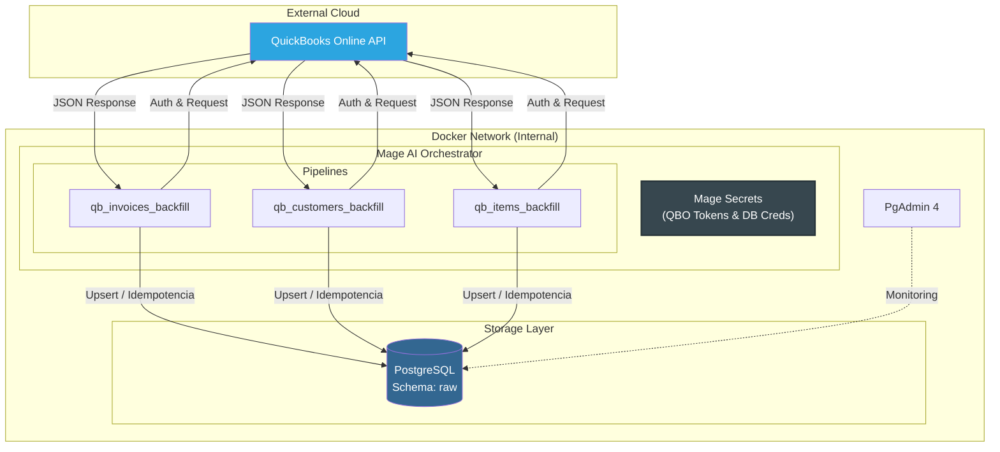

---

# 2. Levantamiento de Docker y Configuración

## 2.1 Docker

Para levantarlo es necesario seguir estos pasos:

### Prerrequisitos

- **Docker Desktop** instalado y en ejecución
- **Git** para clonar el repositorio

### Levantamiento

En una terminal en la raíz del proyecto ejecutar:

```bash
docker compose up -d
```

### Ejecución

Una vez que los contenedores están levantados, se debe acceder a la interfaz de **Mage AI**:

- **URL:** [http://localhost:6789](https://www.google.com/search?q=http://localhost:6789)
- **Credenciales en el docker-compose:**

| Usuario | Contraseña |
|---------|------------|
| `admin@admin.com` | `admin` |

#### Pasos para ejecutar un trigger:

1. En el menú lateral izquierdo, entrar a la sección de **Pipelines**
2. Seleccionar el pipeline que se desee ejecutar (ej: `qb_invoices_backfill`)
3. En el menú lateral del pipeline, seleccionar **Triggers**
4. Entrar en el trigger **Backfill**
5. En la barra superior, **Enable Trigger** y haz clic en el botón **"Run@once"**
6. Hacer clic en el botón de **Logs** del trigger para monitorear la extracción y carga en tiempo real

### Apagado

En una terminal en la raíz del proyecto ejecutar:

```bash
docker compose down
```

---

## 2.2 Configuración

El proyecto ya viene configurado con los volúmenes necesarios, pero si se decide replicarlo desde cero, estos son los pasos clave:

### QuickBooks Online (Origen)

Se necesita crear una empresa Sandbox para obtener acceso a la API:

1. **Registro:** Crear una cuenta en [Intuit Developer](https://developer.intuit.com/)
2. **App Dashboard:** Ir a *My Hub > App Dashboard*, selecciona un workspace y crear una app con el scope de **Accounting**
3. **RealmID:** Entrar a tus [Sandbox Companies](https://developer.intuit.com/sandbox-companies) y copiar el *Company ID* (RealmID) de una
4. **Tokens y Credenciales:** Usar el [OAuth Playground](https://developer.intuit.com/app/developer/playground) seleccionando la app creada para obtener el `Client ID`, `Client Secret` y `Refresh Token`

### PostgreSQL (Destino)

Se debe tomar las credenciales que definidas en el `docker-compose.yml`:

- **User/Password:** `admin` / `admin`
- **Host:** `postgres` (nombre del servicio en la red de Docker)
- **Puerto:** `5432`
- **DB:** `qbo_raw_db`

> **Nota:** Todos estos valores obtenidos (tanto de QBO como de Postgres) deben cargarse en la sección de **Secrets** de Mage para que el orquestador pueda comunicarse con el origen y el destino. Los detalles específicos de cada secret y su propósito se detallan en la siguiente sección: **Gestión de Secretos**.

---

# 3. Gestión de Secretos

Siguiendo las mejores prácticas de seguridad y los requisitos del proyecto, todas las credenciales se gestionan centralizadamente a través de **Mage Secrets**. Se prohíbe el uso de valores *hardcoded* o variables de entorno expuestas en el archivo `docker-compose`.

## 3.1 Listado de Secretos

| Nombre del Secreto | Propósito |
|--------------------|-----------|
| `QBO_CLIENT_ID` | Identificador único de la aplicación en el portal de Intuit Developer. |
| `QBO_CLIENT_SECRET` | Llave privada para la autenticación de la aplicación. |
| `QBO_REALM_ID` | ID de la compañía (Sandbox) de la cual se extraen los datos. |
| `QBO_REFRESH_TOKEN` | Token de larga duración utilizado para generar nuevos Access Tokens. |
| `QBO_ENVIRONMENT` | Define si el endpoint de la API es `sandbox` o `production`. |
| `POSTGRES_HOST` | Nombre del servicio en la red de Docker (`postgres`). |
| `POSTGRES_DB` | Nombre de la base de datos destino para la capa raw. |
| `POSTGRES_USER` | Usuario con permisos de escritura en el esquema `raw`. |
| `POSTGRES_PASSWORD` | Contraseña del usuario de la base de datos. |
| `POSTGRES_PORT` | Puerto de comunicación interna (default: `5432`) |

## 3.2 Rotación

Para mantener el acceso a la API de QuickBooks, la rotación fue implementada de la siguiente manera:

### Access Tokens (Automático)

El código en el `LOADER` de Mage detecta si el Access Token ha expirado y utiliza el `QBO_REFRESH_TOKEN` para obtener uno nuevo al inicio de cada ejecución.

### Refresh Tokens (Manual/Semiautomático)

Los Refresh Tokens de QBO tienen una validez de hasta 100 días, pero pueden rotar en cada uso:

- **Monitoreo:** El pipeline emite un `logger.warning("[AUTH-ROTATION]")` si la API entrega un nuevo Refresh Token
- **Acción:** Se debe copiar el nuevo valor del log y actualizar manualmente el secret `QBO_REFRESH_TOKEN` en la interfaz de Mage para asegurar que la siguiente ejecución no falle

## 3.3 Responsables

- **Database Administrator (DBA):** Responsable de configurar los secretos de **PostgreSQL** (Host, DB, User, Password), aunque para la implementación actual donde dichos datos estan en el `docker-compose.yml` informalmente será el administrador de la infraestructura que armo dicho archivo.
- **Data Engineer (Dueño del Pipeline):** Responsable de obtener los tokens iniciales de QBO, configurar los secretos en Mage y realizar la rotación manual del `Refresh Token`.

---

# 4. Detalle de los Pipelines

Se cuenta con tres pipelines: `qb_invoices_backfill`, `qb_customers_backfill` y `qb_items_backfill`. Todos comparten una misma lógica de ejecución robusta y escalable.

## 4.1 Parámetros de Ejecución

Cada pipeline acepta los siguientes argumentos setteados a través de los *Runtime Variables* de los *Triggers* de Mage:

| Parámetro | Tipo | Descripción | Ejemplo |
|-----------|------|-------------|---------|
| `fecha_inicio` | ISO8601 | Fecha de inicio del backfill (inclusive). | `2024-01-01T00:00:00Z` |
| `fecha_fin` | ISO8601 | Fecha de fin del backfill (inclusive). | `2024-01-31T23:59:59Z` |
| `resume_from` | ISO8601 | (Opcional) Punto de reanudación tras una falla. | `2024-01-15T00:00:00Z` |

## 4.2 Lógica de Segmentación y Límites

Para que los pipes no excedan las capacidades de la API de QBO ni la memoria del contenedor se implementaron las siguientes prácticas:

- **Segmentación (Chunking):** El rango de fechas se divide en tramos de **1 día** (`CHUNK_DAYS = 1`). Esto hace que, si falla un día 'n' dentro del rango de fechas, no se pierdan los días que sí se obtuvieron antes del 'n'

- **Paginación:** Dentro de cada día, se leen registros en lotes de **10** (`PAGE_SIZE = 10`) usando `STARTPOSITION` y `MAXRESULTS`. Se recorren todas las páginas, frenando cuando un lote llega incompleto

- **Esperas de Cortesía:** Se implementa un `COURTESY_WAIT` de **0.5s** entre páginas para evitar saturar el thread de ejecución y la API de QBO

## 4.3 Resiliencia y Reintentos

Se implementó un soporte a fallas comunes de red o límites de la API de QBO:

- **Backoff Exponencial:** Ante errores `429` (Rate Limit) o fallas de red, el sistema realiza hasta **5 reintentos** (`MAX_RETRIES`) duplicando el tiempo de espera inicial de **5 segundos**

- **Manejo de Sesión:** Al recibir un error `401`, el `LOADER` detecta la expiración y utiliza el Refresh Token para obtener un nuevo Access Token y reintentar la petición

- **Circuit Breaker:** Al acumular **3 tramos (días) fallidos de forma consecutiva**, el pipeline se detiene por completo para evitar desperdicio de recursos o bloqueos de cuenta

---

## 4.4 Runbook de Operación y Recuperación

### Cómo verificar el éxito

1. Revisar los logs en Mage con el mensaje `[EXTRACTION-COMPLETE]`
2. Verificar el **Reporte de Calidad** en el bloque del Exporter, el cual mostrará:
   - Registros nuevos vs. actualizados (Idempotencia)
   - Volumetría por tramo (ventanas de tiempo procesadas)
   - Alertas en caso de inconsistencias temporales

### Procedimiento de Reintento (Falla parcial)

Si el pipeline falla (por ejemplo, por una caída de internet prolongada o una falla en la API de QBO), se deben seguir los siguientes pasos:

1. **Localizar el Checkpoint:** Abrir los logs de trigger de Mage y buscar el bloque de error crítico marcado como `[CHECKPOINT]`

2. **Copiar el Valor:** El log le indicará exactamente el valor para reanudar, por ejemplo: `resume_from = '2024-01-10T00:00:00+00:00'`

3. **Configurar y Lanzar:**
   - Ir a los ajustes del Trigger
   - Agregar el parámetro `resume_from` con el valor copiado
   - Ejecutar el trigger nuevamente con **Run@once**

---

# 5. Trigger One-Time

Los triggers son de ejecución única de manera que el *backfill* no se repite automáticamente, evitando sobrecargas a la API de QBO.

## 5.1 UTC y equivalencia a Guayaquil

Los parametros que recibe `fecha_inicio` y `fecha_fin` están en UTC y toda la logíca de los pipes trabaja con UTC porque es el tiempo estándar por el cual se rige todo el mundo. Esto quiere decir que los logs de los triggers muestran las fechas de ejecución en UTC por lo que es importante saber su equivalencia con nuestra zona horaria Guayaquil.

Nosotros estamos desfasados 5 horas detrás de UTC, por eso se nos denota como UTC-5 y la conversión es directa:

Hora Guayaquil = UTC - 5

Por lo que, si se quiere ver las fechas de los logs es importante tomar en cuenta que la hora en Ecuador es la reflejada - 5.

## 5.2 Política de deshabilitación

Automaticamente en Mage cuando se completa un trigger `Run@Once` este se marca como deshabilitado para que no se vuelve a ejecutar nunca más, a menos de que se lo vuelva a habilitar y ejecutar otra vez.

---

# 6. Esquema RAW

En base a los requisitos del proyecto se creo un squema `raw` en PostgreSQL, con las siguientes características:

## 6.1 Tablas por Entidad

Están definidas 3 tablas correspondientes a las entidades extraídas:

- `raw.qb_invoice`
- `raw.qb_customer`
- `raw.qb_item`

## 6.2 Estructura de la Tabla

Todas las tablas contienen la misma estructura:

| Columna | Tipo de Dato | Descripción |
|---------|--------------|-------------|
| `id` | `VARCHAR` | **Primary Key.** ID único de la entidad en QBO |
| `payload` | `JSONB` | El objeto completo retornado por la API en formato binario |
| `ingested_at_utc` | `TIMESTAMPTZ` | Fecha y hora exacta en la que el registro se insertó en Postgres |
| `extract_window_start_utc` | `TIMESTAMPTZ` | Inicio de la ventana temporal de extracción definida en el chunk |
| `extract_window_end_utc` | `TIMESTAMPTZ` | Fin de la ventana temporal de extracción definida en el chunk |
| `page_number` | `INT` | Número de página de la API de donde provino el registro |
| `page_size` | `INT` | Cantidad de registros solicitados en la petición |
| `request_payload` | `TEXT` | La sentencia SQL exacta enviada a la API de QuickBooks |
| `source_last_updated_utc` | `TIMESTAMPTZ` | Fecha de última modificación del registro en el origen (QBO) |

## 6.3 Idempotencia y Lógica de Upsert

La **idempotencia** se garantiza en los pipelines mediante la implementación de la sentencia `ON CONFLICT (id) DO UPDATE` en el `Exporter`. Lo que permite que ejecutar el triger más de una vez con los mismos parámetros no genere datos duplicados.

### Mecanismo de Control:

1. **Clave Primaria:** Se utiliza el `id` original de QuickBooks como clave primaria en Postgres
2. **Resolución de Conflictos:** Si el pipeline intenta insertar un registro que ya existe:
   - No se genera un error
   - Se sobreescriben el `payload` y los metadatos con la información más reciente en la BDD

## 6.4 Validaciones de Integridad

El **Exporter** del pipeline incluye lógica de validación antes de la carga:

- **Omitir Nulos:** Cualquier registro sin un `id` válido es descartado y registrado en el log de errores
- **Consistencia Temporal:** Se verifica que la fecha de ingesta esté en la ventana de extracción, sino, se emite un `[TEMPORAL-ANOMALY]` en los logs del trigger

---

# 7. Validaciones/Volumetría

Los pipelines tienen una auditoría automática para validar la ingesta de datos y detectar anomalías, esta se muestra en los logs de los triggers.

## 7.1 Cómo ejecutar las validaciones

Como se mencionó, las validaciones son **automáticas**. Se ejecutan cada vez que el pipeline corre.

Para ver los resultados:

1. Ir a los **Logs** del trigger
2. Buscar volumentría por tramos debajo de `[CHUNK]` con titulos como `[VOLUMETRY]` y `[METRICS]` en el LOADER Y `[CHUNK-VOLUMETRY]` y `[VOLUMETRY]` en el EXPORTER.
3. Buscar volumetría general al fianl de los logs con el encabezado `--- REPORTE DE CALIDAD ---`

## 7.2 Interpretación de Resultados

Al final de la ejecución se imprime un log de resumen con lo siguiente:

- **Registros procesados:** Cantidad total de filas enviadas desde el Loader
- **Nuevos vs. Actualizados:**
  - Si **Nuevos > 0**, son registros que no existían en Postgres
  - Si **Actualizados > 0**, hubieron registros existentes que fueron actualizados (idempotencia)
- **Inconsistencias Temporales:** Si es mayor a 0, hay registros con una fecha de modificación en el origen que no hace sentido con la ventana de extracción (Ej: Se piden datos entre las 8:00 PM - 9:00 PM pero se obtiene un registro con `LastUpdatedTime` = 09:05 PM)
- **Registros omitidos:** Son filas se descartadas por tener un ID nulo (falla de integridad)

## 7.3 Verificación Manual (SQL)

También se pueden hacer validaciones manuales en **PgAdmin**, se detallan los querys:

### Conteo total por entidad

Verificar el total de registros por entidad:

```sql
SELECT count(*), 'Invoices' as entidad FROM raw.qb_invoice
UNION ALL
SELECT count(*), 'Customers' FROM raw.qb_customer
UNION ALL
SELECT count(*), 'Items' FROM raw.qb_item;

```

### Validación de Volumetría por Ventana de Extracción

Verificar días vacíos o caidas en el volumen de datos:

```sql
SELECT 
    extract_window_start_utc, 
    extract_window_end_utc, 
    count(*) as total_registros
FROM raw.qb_invoice -- 'invoice' | 'customer' | 'item'
GROUP BY 1, 2
ORDER BY 1 DESC;

```

### Verificación de Idempotencia

Confirmar que no hay duplicados por ID:

```sql
SELECT id, count(*) 
FROM raw.qb_invoice -- 'invoice' | 'customer' | 'item'
GROUP BY id 
HAVING count(*) > 1;
-- El resultado debe ser 0
```

---

# 8. Troubleshooting

En esta sección se detallan los errores comunes y las acciones correctivas para asegurar la continuidad de los pipelines.

## 8.1 Autenticación

- **Problema:** En el log sale `[AUTH] Error en OAuth` o el pipe falla con `Exception: OAuth Failure: 400/401`
- **Causa:** El `QBO_REFRESH_TOKEN` expiró o es inválido
- **Solución:** Generar un nuevo token en el [OAuth Playground de Intuit](https://developer.intuit.com/app/developer/playground) y actualizar el secret

> **Nota:** Esta solución podria ser necesaria si se utiliza el refresh token antes y se lo quiere volver en aprox más de 1 día despues, entonces ahi este se puede rotar por QBO y no hay otra opción que volver a generarlo. Por esto la entrega del proyecto se hace con un nuevo refresh token sin usarse para que sea válido por 101 días antes de que se prueba para su calificación.

---

- **Problema:** Alerta `[AUTH-ROTATION]` en los logs
- **Causa:** QBO creo un nuevo Refresh Token durante la ejecución
- **Solución:** Copiar el token del log, actualizar el secret `QBO_REFRESH_TOKEN` y volver a ejecutar el trigger

---

> **Nota:** Estas soluciones manuales son ncesarias porque no se pueden sobreescribir secrets en Mage.

## 8.2 Paginación y Límites

- **Problema:** En los logs salen advertencias de `[RATE-LIMIT] HTTP 429`
- **Acción Automática:** El sistema aplica **Exponential Backoff** (espera 5s, 10s, 20s...)
- **Acción Manual:** Si los reintentos fallan constantemente, se pueden editar las constantes del **LOADER**:
  - Aumentar `COURTESY_WAIT`, para tener más tiempo entre páginas (Ej: 1)
  - Aumentar `INITIAL_BACKOFF`, para comenzar esperando mas tiempo entre reintentos (Ej: 10)

---

- **Problema:** El **Circuit Breaker** detuvo el pipeline tras 3 fallos
- **Causa:** Se excedió el límite de peticiones diarias o la API de QBO está caída
- **Solución:** Esperar unos minutos y reiniciar el pipeline usando el parámetro `resume_from` indicado en el log (en caso de que se haya podido ingestar algun tramo antes del fallo)


## 8.3 Zonas Horarias (Timezones)

- **Problema:** Advertencia `[TEMPORAL-ANOMALY]` o inconsistencias en los conteos
- **Causa:** Las fechas de entrada no están en formato ISO 8601 o no se especificó la zona horaria
- **Solución:** Verificar que `fecha_inicio` y `fecha_fin` terminen en `Z`. Verificar que no se hayan cambiado las zonas horarios en los contenedores, en `docker-compose.yml` deben estar estas variables `TZ=UTC`

## 8.4 Almacenamiento y Permisos

- **Problema:** El Exporter muestra `[DB-FAIL]`
- **Causa:** El contenedor de Postgres no es accesible o las credenciales son incorrectas
- **Solución:**
  1. Verificar que el secret `POSTGRES_HOST` sea `postgres` (o el nomber del servicio en el `docker-compose.yml`)
  2. Ejecutar `docker ps` y verificar que el contenedor `qbo_postgres` está en estado *healthy*

---

* **Problema:** Error de escritura en el esquema `raw` o fallo al arrancar contenedores en **Linux/macOS**.
* **Causa:** Los permisos de los volúmenes bindeados no coinciden con los usuarios internos de los contenedores (Postgres: 999, Mage: 1000).
* **Solución:** Asignar la propiedad de las carpetas a los usuarios correspondientes mediante los siguientes comandos en la raíz del proyecto:

```bash
sudo chown -R 999:999 ./postgres_data

sudo chown -R 1000:1000 ./mage_data

sudo chmod -R 777 ./postgres_data ./mage_data
```

# 9. Evidencias

## 9.1 Gestión de Secretos

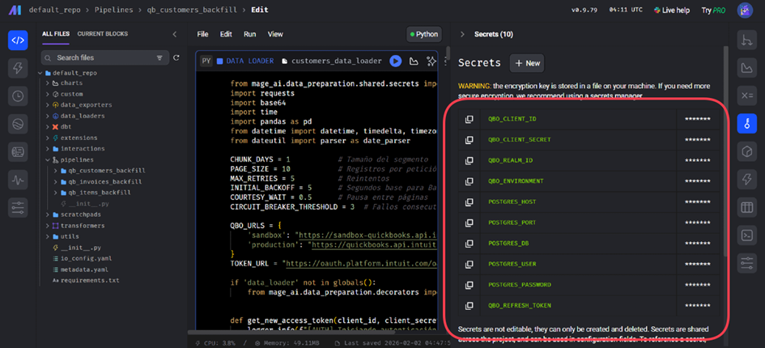

## 9.2 Triggers One-time

Se programó un trigger de ejecución única para cada pipe de Mage. En la imagenes de completed se puede ver en el lateral izquierda en letras rojas que los triggers están deshabilitados y en el cículo rojo que se completaron:

### qb_customers_backfill

Setup:
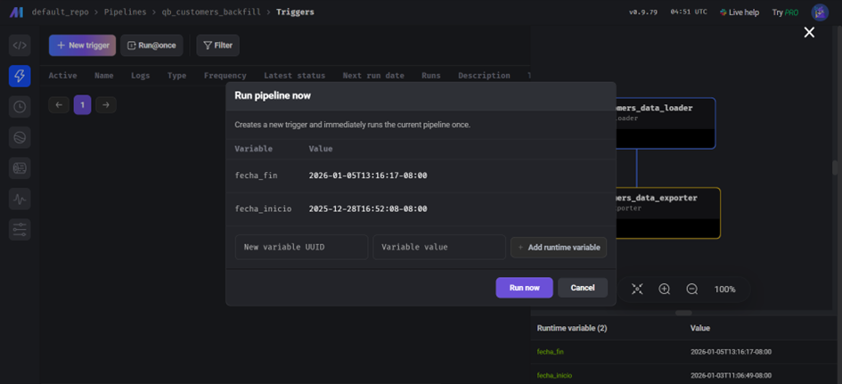

Completed:
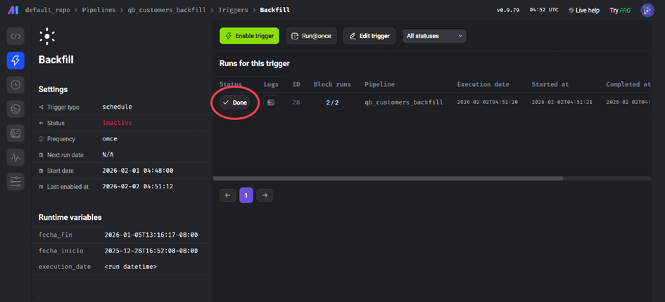

### qb_invoices_backfill

Setup:
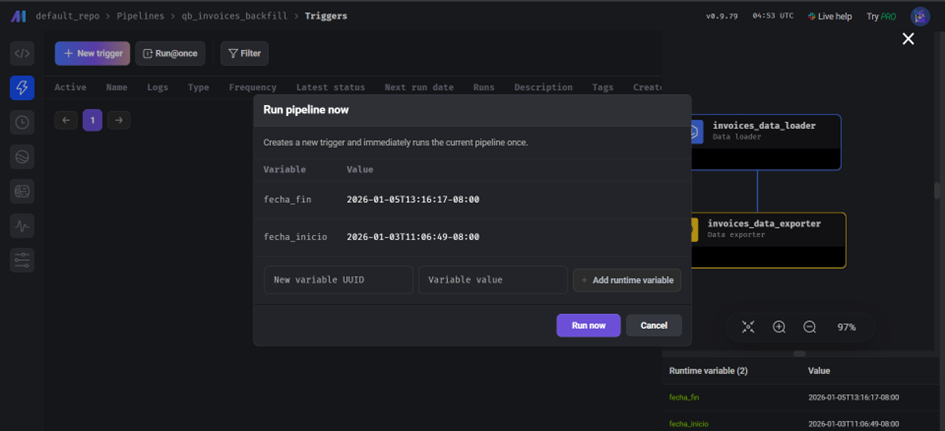

Completed:
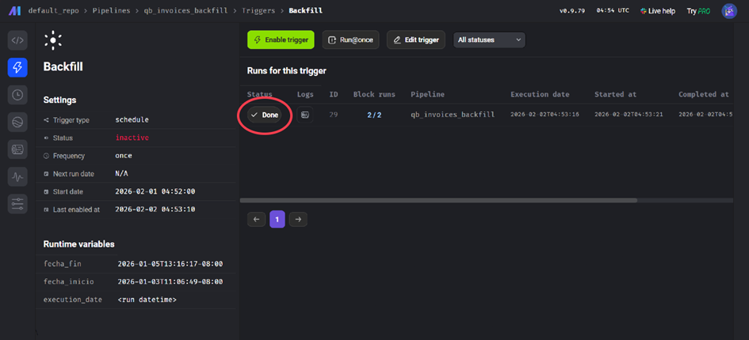


### qb_items_backfill

Setup:
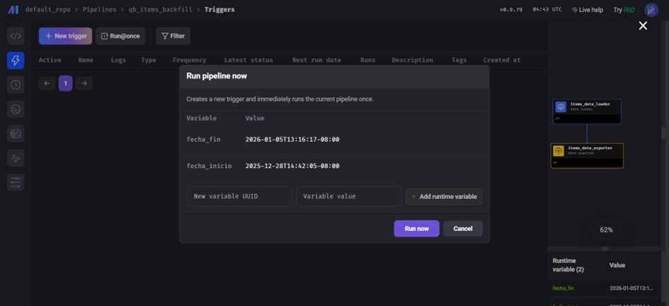

Completed:
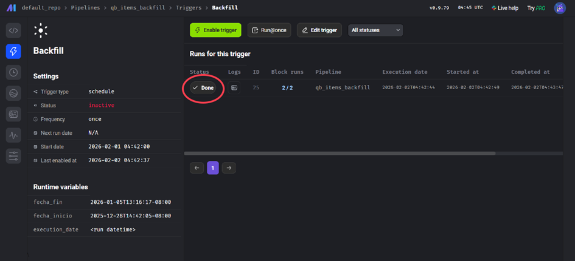

## 9.3 Tablas RAW

Schema:
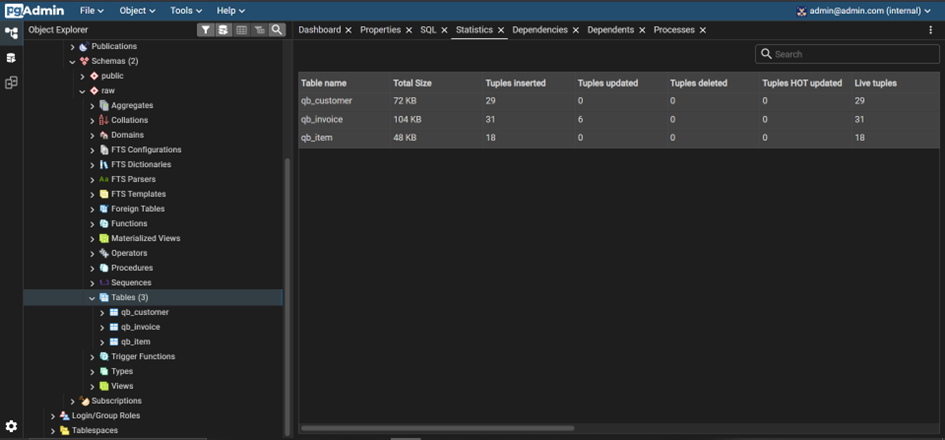

### Data

Customer:
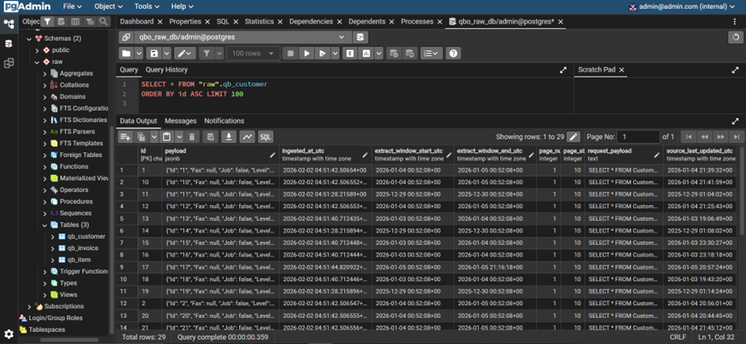

Invoice:
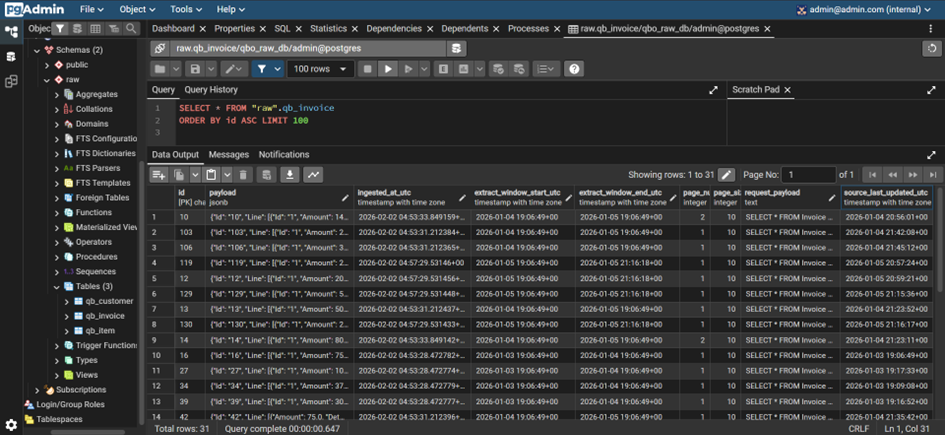

Item:
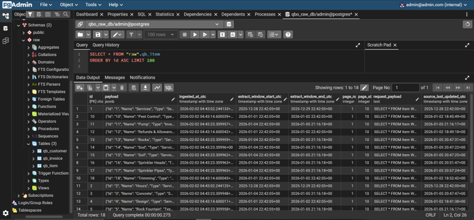

## 9.4 Volumetría e Idempotencia

### Volumetría

Visualización en el loader, se puede ver por tramo los registros leídos, páginas y duración (es lo que está después de `[METRICS]`):
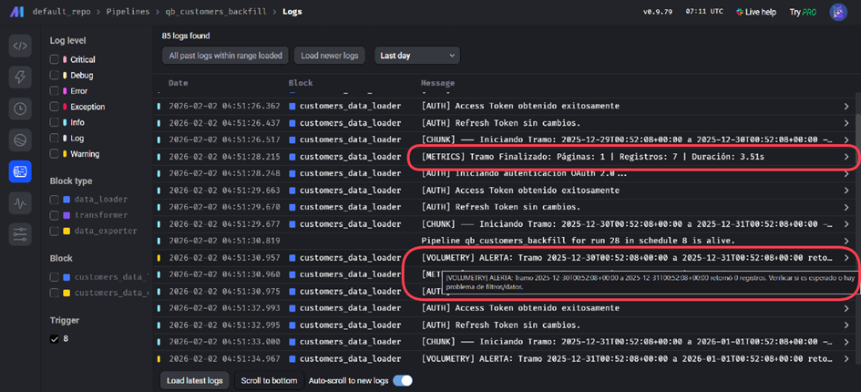

Visualización en el exporter, se puede ver por tramo el numero de registros insertados (es lo que está en azul):
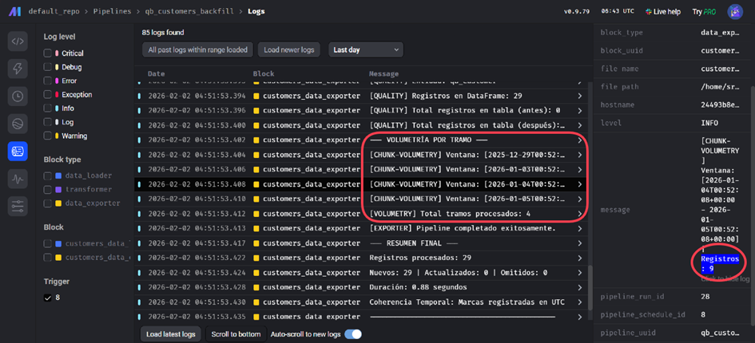

### Idempotencia

Ejecución de trigger (por segunda vez) en `qb_invoices_backfill` con el parametro `resume_from` para repetir el ultimo chunk:
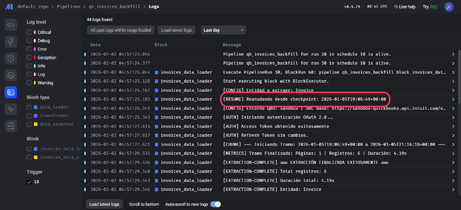

Evidencia la actualización de los registros que se volvieron a obtener en lugar de agregarlos; es decir, NO duplica los registros:
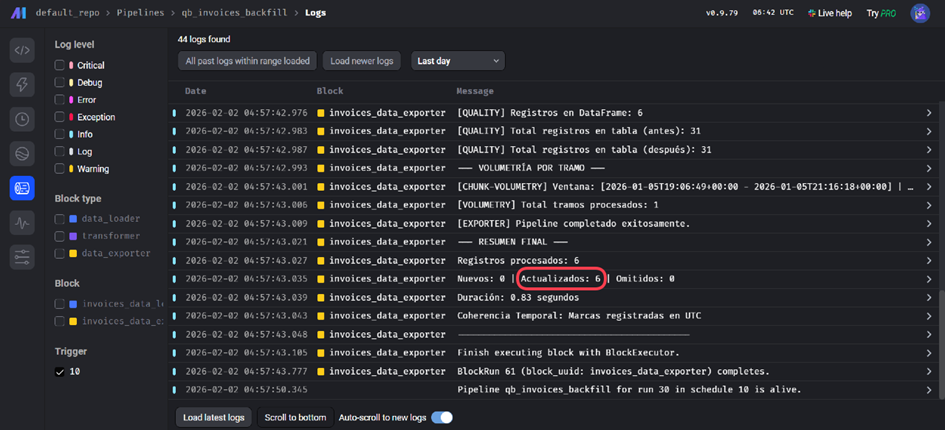


# 10. Checklist de Aceptación

- [x] Mage y Postgres se comunican por nombre de servicio (`postgres`).
- [x] Todos los secretos (QBO y Postgres) están en Mage Secrets; no hay secretos en el repo.
- [x] Los pipelines aceptan `fecha_inicio` y `fecha_fin` (UTC) y segmentan por días.
- [x] Trigger one-time configurado, ejecutado y deshabilitado tras el éxito.
- [x] Esquema `raw` creado con tablas por entidad, payload JSONB y metadatos.
- [x] Idempotencia verificada: la re-ejecución no genera duplicados (Upsert).
- [x] Paginación y Rate Limits manejados correctamente con Backoff.
- [x] Volumetría y validaciones registradas en la carpeta de evidencia.
- [x] Runbook de reanudación disponible en el README.