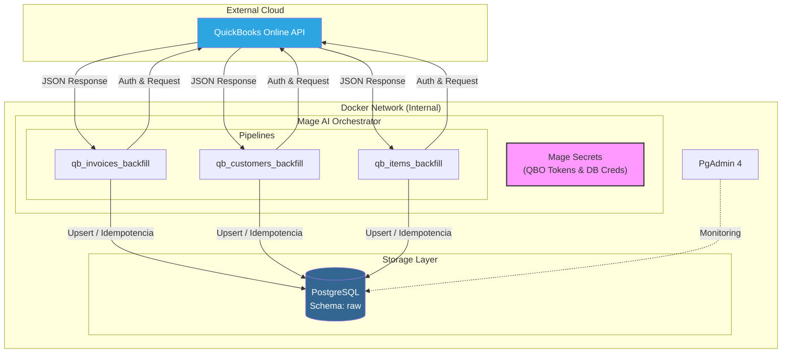

# Arquitectura

## Descripción

El proyecto implementa una arquitectura de ingesta de datos **EL (Extract y Load)** sin un bloque de transformación (*Transformer*), ya que no se requiere modificar los payloads, sino simplemente agregar metadatos de auditoría. Dicha ingesta de datos está construida sobre un entorno de **Docker** con tres servicios (Mage, Postgres y PgAdmin) y está estructurada de la siguiente manera:

- **Origen:** La API de **QuickBooks Online (QBO)** expone datos de "invoices", "customers" e "items" de una empresa *sandbox* mediante el protocolo **OAuth 2.0**. Este es manejado con la generación de *access tokens* a través del *refresh token* y cuenta con una rotación de *refresh tokens* durante el *backfill* para asegurar el éxito de una ejecución larga.

- **Orquestador:** **Mage AI** actúa como el motor del procesamiento, ejecutando tres pipelines parametrizados (`qb_invoices_backfill`, `qb_customers_backfill`, `qb_items_backfill`) mediante **triggers de ejecución única (one-time)**. Dichos pipelines ejecutan la ingesta EL conectándose con la API del origen de datos y cargando la información directamente en el destino.

- **Destino:** **PostgreSQL** almacena los datos extraídos en un esquema `raw` utilizando el formato **JSONB** para preservar el *payload* original, junto con los metadatos obtenidos y generados en el *Loader*.

> **Nota:** La seguridad de las credenciales utilizadas es gestionada por **Mage AI** a través de sus *Secrets*, la comunicación entre los servicios está garantizada por la red interna de Docker mediante nombres de servicio y el servicio de **PgAdmin** solo se usa para visualizar los datos de la BDD.

---

## Diagrama



---

# Levantamiento de Docker y Configuración

## 1. Docker

Para levantarlo es necesario seguir estos pasos:

### Prerrequisitos

- **Docker Desktop** instalado y en ejecución
- **Git** para clonar el repositorio

### Levantamiento

En una terminal en la raíz del proyecto ejecutar:

```bash
docker-compose up -d
```

### Ejecución

Una vez que los contenedores están levantados, se debe acceder a la interfaz de **Mage AI**:

- **URL:** [http://localhost:6789](https://www.google.com/search?q=http://localhost:6789)
- **Credenciales en el docker-compose:**

| Usuario | Contraseña |
|---------|------------|
| `admin@admin.com` | `admin` |

#### Pasos para ejecutar un trigger:

1. En el menú lateral izquierdo, entrar a la sección de **Pipelines**
2. Seleccionar el pipeline que se desee ejecutar (ej: `qb_invoices_backfill`)
3. En el menú lateral del pipeline, seleccionar **Triggers**
4. Entrar en el trigger **Backfill**
5. En la barra superior, **Enable Trigger** y haz clic en el botón **"Run@once"**
6. Hacer clic en el botón de **Logs** del trigger para monitorear la extracción y carga en tiempo real

---

## 2. Configuración

El proyecto ya viene configurado con los volúmenes necesarios, pero si se decide replicarlo desde cero, estos son los pasos clave:

### QuickBooks Online (Origen)

Se necesita crear una empresa Sandbox para obtener acceso a la API:

1. **Registro:** Crear una cuenta en [Intuit Developer](https://developer.intuit.com/)
2. **App Dashboard:** Ir a *My Hub > App Dashboard*, selecciona un workspace y crear una app con el scope de **Accounting**
3. **RealmID:** Entrar a tus [Sandbox Companies](https://developer.intuit.com/sandbox-companies) y copiar el *Company ID* (RealmID) de una
4. **Tokens y Credenciales:** Usar el [OAuth Playground](https://developer.intuit.com/app/developer/playground) seleccionando la app creada para obtener el `Client ID`, `Client Secret` y `Refresh Token`

### PostgreSQL (Destino)

Se debe tomar las credenciales que definidas en el `docker-compose.yml`:

- **User/Password:** `admin` / `admin`
- **Host:** `postgres` (nombre del servicio en la red de Docker)
- **Puerto:** `5432`
- **DB:** `qbo_raw_db`

> **Nota:** Todos estos valores obtenidos (tanto de QBO como de Postgres) deben cargarse en la sección de **Secrets** de Mage para que el orquestador pueda comunicarse con el origen y el destino. Los detalles específicos de cada secreto y su propósito se detallan en la siguiente sección: **Gestión de Secretos**.

---

# Gestión de Secretos

Siguiendo las mejores prácticas de seguridad y los requisitos del proyecto, todas las credenciales se gestionan centralizadamente a través de **Mage Secrets**. Se prohíbe el uso de valores *hardcoded* o variables de entorno expuestas en el archivo `docker-compose`.

## Listado de Secretos

| Nombre del Secreto | Propósito |
|--------------------|-----------|
| `QBO_CLIENT_ID` | Identificador único de la aplicación en el portal de Intuit Developer. |
| `QBO_CLIENT_SECRET` | Llave privada para la autenticación de la aplicación. |
| `QBO_REALM_ID` | ID de la compañía (Sandbox) de la cual se extraen los datos. |
| `QBO_REFRESH_TOKEN` | Token de larga duración utilizado para generar nuevos Access Tokens. |
| `QBO_ENVIRONMENT` | Define si el endpoint de la API es `sandbox` o `production`. |
| `POSTGRES_HOST` | Nombre del servicio en la red de Docker (`postgres`). |
| `POSTGRES_DB` | Nombre de la base de datos destino para la capa raw. |
| `POSTGRES_USER` | Usuario con permisos de escritura en el esquema `raw`. |
| `POSTGRES_PASSWORD` | Contraseña del usuario de la base de datos. |
| `POSTGRES_PORT` | Puerto de comunicación interna (default: `5432`) |

## Rotación

Para mantener el acceso a la API de QuickBooks, la rotación fue implementada de la siguiente manera:

### Access Tokens (Automático)

El código en el `LOADER` de Mage detecta si el Access Token ha expirado y utiliza el `QBO_REFRESH_TOKEN` para obtener uno nuevo al inicio de cada ejecución.

### Refresh Tokens (Manual/Semiautomático)

Los Refresh Tokens de QBO tienen una validez de hasta 100 días, pero pueden rotar en cada uso:

- **Monitoreo:** El pipeline emite un `logger.warning("[AUTH-ROTATION]")` si la API entrega un nuevo Refresh Token
- **Acción:** Se debe copiar el nuevo valor del log y actualizar manualmente el secreto `QBO_REFRESH_TOKEN` en la interfaz de Mage para asegurar que la siguiente ejecución no falle

## Responsables

- **Administrador de Infraestructura:** Responsable de configurar los secretos de PostgreSQL durante el despliegue inicial
- **Data Engineer (Dueño del Pipeline):** Responsable de obtener los tokens iniciales de QBO, configurar los secretos en Mage y realizar la rotación manual del `Refresh Token` cuando la API lo solicite

---

# Detalle de los Pipelines

Se cuenta con tres pipelines: `qb_invoices_backfill`, `qb_customers_backfill` y `qb_items_backfill`. Todos comparten una misma lógica de ejecución robusta y escalable.

## Parámetros de Ejecución

Cada pipeline acepta los siguientes argumentos setteados a través de los *Runtime Variables* de los *Triggers* de Mage:

| Parámetro | Tipo | Descripción | Ejemplo |
|-----------|------|-------------|---------|
| `fecha_inicio` | ISO8601 | Fecha de inicio del backfill (inclusive). | `2024-01-01T00:00:00Z` |
| `fecha_fin` | ISO8601 | Fecha de fin del backfill (inclusive). | `2024-01-31T23:59:59Z` |
| `resume_from` | ISO8601 | (Opcional) Punto de reanudación tras una falla. | `2024-01-15T00:00:00Z` |

## Lógica de Segmentación y Límites

Para que los pipes no excedan las capacidades de la API de QBO ni la memoria del contenedor se implementaron las siguientes prácticas:

- **Segmentación (Chunking):** El rango de fechas se divide en tramos de **1 día** (`CHUNK_DAYS = 1`). Esto hace que, si falla un día 'n' dentro del rango de fechas, no se pierdan los días que sí se obtuvieron antes del 'n'

- **Paginación:** Dentro de cada día, se leen registros en lotes de **10** (`PAGE_SIZE = 10`) usando `STARTPOSITION` y `MAXRESULTS`. Se recorren todas las páginas, frenando cuando un lote llega incompleto

- **Esperas de Cortesía:** Se implementa un `COURTESY_WAIT` de **0.5s** entre páginas para evitar saturar el thread de ejecución y la API de QBO

## Resiliencia y Reintentos

Se implementó un soporte a fallas comunes de red o límites de la API de QBO:

- **Backoff Exponencial:** Ante errores `429` (Rate Limit) o fallas de red, el sistema realiza hasta **5 reintentos** (`MAX_RETRIES`) duplicando el tiempo de espera inicial de **5 segundos**

- **Manejo de Sesión:** Al recibir un error `401`, el `LOADER` detecta la expiración y utiliza el Refresh Token para obtener un nuevo Access Token y reintentar la petición

- **Circuit Breaker:** Al acumular **3 tramos (días) fallidos de forma consecutiva**, el pipeline se detiene por completo para evitar desperdicio de recursos o bloqueos de cuenta

---

## Runbook de Operación y Recuperación

### Cómo verificar el éxito

1. Revisar los logs en Mage con el mensaje `[EXTRACTION-COMPLETE]`
2. Verificar el **Reporte de Calidad** en el bloque del Exporter, el cual mostrará:
   - Registros nuevos vs. actualizados (Idempotencia)
   - Volumetría por tramo (ventanas de tiempo procesadas)
   - Alertas en caso de inconsistencias temporales

### Procedimiento de Reintento (Falla parcial)

Si el pipeline falla (por ejemplo, por una caída de internet prolongada o una falla en la API de QBO), se deben seguir los siguientes pasos:

1. **Localizar el Checkpoint:** Abrir los logs de trigger de Mage y buscar el bloque de error crítico marcado como `[CHECKPOINT]`

2. **Copiar el Valor:** El log le indicará exactamente el valor para reanudar, por ejemplo: `resume_from = '2024-01-10T00:00:00+00:00'`

3. **Configurar y Lanzar:**
   - Ir a los ajustes del Trigger
   - Agregar el parámetro `resume_from` con el valor copiado
   - Ejecutar el trigger nuevamente con **Run@once**

Tu README está quedando muy completo y profesional. Para esta sección, la rúbrica pide específicamente la transparencia en el manejo de zonas horarias y qué pasa con el trigger una vez que termina la tarea.

# Trigger One-Time
Los triggers son de ejecución única de manera que el *backfill* no se repite automáticamente, evitando sobrecargas a la API de QBO.

